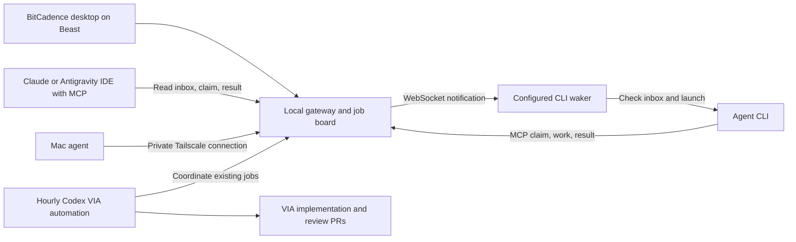

# VIA build mesh: start here

Verified September 8, 2026. This is a local development setup; it is not proof of cloud deployment or completed cross-provider delivery.

## What runs where

Beast runs the gateway at http://127.0.0.1:18789. The BitCadence desktop app supervises the gateway and configured worker processes. The gateway holds the shared job board and records job ownership and results. It does not directly type into open AI apps.

A waker listens for job notifications, checks its inbox and starts its configured agent command. The agent must claim a lease before working and report its result. An IDE uses the same MCP tools, but opening the IDE alone does not start an unattended build worker. A connected process, an authenticated heartbeat, a claimed job and a completed contribution are four different kinds of evidence.

## Starting and stopping

1. Open the **BitCadence** desktop shortcut on Beast.
2. Choose **Start all**. Wait for gateway readiness. Worker processes being present does not prove provider authentication or job pickup.
3. Open the gateway dashboard at http://127.0.0.1:18789. Check job status and agent presence.
4. Closing the window hides it in the notification area when tray support is installed. Exiting the app stops processes it owns. **Stop all** stops the managed stack.
5. The sign-in shortcut starts this same supervisor with `--start-all --minimized`. Beast must remain awake and signed in. This is not an always-on cloud service.

Install the sign-in shortcut with `scripts/desktop_autostart.ps1 -Pythonw C:/AI/baton/Batoncadence/.venv/Scripts/pythonw.exe`; remove it with `scripts/desktop_autostart.ps1 -Remove`. The shortcut depends on this checkout remaining at its current path. Previously disabled standalone worker scheduled tasks should stay disabled to avoid competing ownership.

The Mac uses http://beast.tail5c7c26.ts.net:18789 over the private Tailscale network. Tailscale must be connected on both machines. Beast's existing HTTPS service on port 443 is preserved. The added TCP forwarder can be removed with `tailscale serve --tcp=18789 off`. Do not use Funnel or public port forwarding for this gateway.

In Antigravity, refresh/reconnect the configured MCO server and ask: **“Call mco_inbox, claim my assigned VIA job, work within its stated file ownership, and complete it with a commit/PR and evidence. Report any connection or authentication error exactly.”** Do not paste agent tokens into chat. Repeat on the Mac only after it can reach Beast. This explicit interaction is needed until a supported unattended executor is configured for that IDE.

## The actual VIA project and loop

The repository is **C:/AI/via-catholica**, remote **mastalink/via**. C:/AI/vi does not exist. The active backend worktree is **C:/AI/via-global-data-design**; it contains ongoing location-search changes owned by another Codex task. Do not share that working directory between unattended agents.

The existing **Continue Via backend delivery** automation remains active hourly in **Plan Catholic church finder app**. Its instructions now require one bounded delivery step, current ownership checks, coordinated integration, focused validation and an updated contribution ledger. It reuses existing Claude/Grok jobs. It does not authorize bypassing acceptance gates or changing budgets. Pause that automation to stop scheduled VIA work; stopping the desktop stack is a separate control.

The current integration bottleneck is stacked draft PRs, including competing cancellation migration 007 changes in PRs #15 and #16. The coordinator must consolidate one reviewed path before deployment and coordinate issue #14 scheduler ownership. PR #16 and #17 checks passed in the audit; passing checks alone does not establish production readiness. A recent Codex turn failed because workspace credits were exhausted; future runs still depend on available credits.

## Contribution ledger: initial snapshot

| Actor | Assignment and evidence | Verified state |
|---|---|---|
| Codex backend task | PR #17, commit 6b84b62 at audit; CI passed; location-search edits in progress | Code and checks exist; not a deployed release |
| Codex mesh coordinator | This guide, desktop startup controls, hourly-loop update and queue coordination | Local changes; separate from VIA application implementation |
| Claude Beast | Multilingual evidence research; job `59087b3f-96ef-414c-86e3-2f95b530bcf9` | Pending at latest queue read; no current completion receipt |
| Grok Beast | Source-registry/distributed-ingestion research; job `bfa2472c-757e-4fa6-9bac-72b4d3773f84` | Pending at latest queue read; no current completion receipt |
| Antigravity Beast | Existing issue #12 publisher census; job `b557ca07-344c-4671-b489-8e08a3870c68`; owns one new research document | Dispatched, pending; execution not verified |
| Antigravity Mac | Available for later independent evidence review after connection verification | No new assignment; stale registry heartbeat and SSH connection refused |

Append each actual delivery to VIA's `docs/continuous-build-ledger.md`: UTC time, provider and instance, job ID, lease/completion status, owned files, commit, PR, validation and remaining blocker. Attribute only work supported by receipts. Never relabel queued work or this Codex session's work as another provider's contribution.

## What remains unproven

The local gateway responds and the private forwarder is configured. Registry heartbeats for the worker identities were stale at the final connectivity check, despite supervised processes. End-to-end automatic pickup needs a fresh authenticated worker heartbeat, lease and completion receipt. Mac remote access was not verified: the SSH attempt was refused. These are open operational blockers, not successful fleet acceptance.
