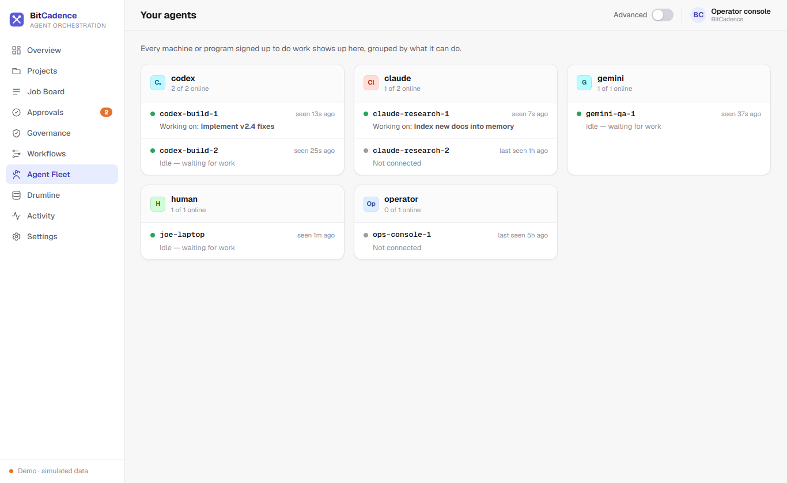
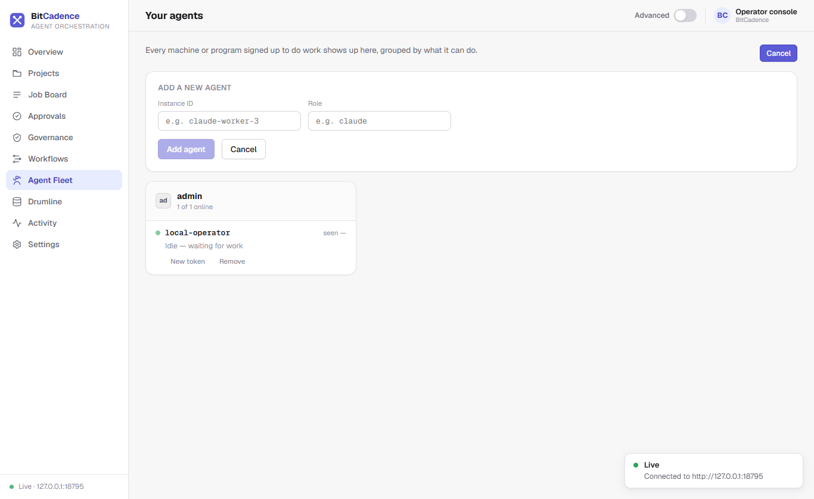

# Agent Fleet & Presence

## Goal
Register worker agent instances, inspect live connection heartbeats, rotate access tokens, assign roles, and monitor what each agent is currently working on.

---

## Step-by-Step Instructions

### 1. View Registered Agents
In the left navigation sidebar, click **Agent Fleet** (or *"Your agents"*).



Agents are grouped by their primary capability role:
- `codex` — Code generation, test implementation, and builds.
- `claude` — Architecture research, documentation, and analysis.
- `gemini` — QA verification and regression testing.
- `human` / `operator` — Approvers and operations oversight.
- `reviewer` — Independent verification and security reviews.

Each agent card shows:
- **Instance ID:** Unique identifier for that worker machine or container.
- **Heartbeat Status:** Pulsing green dot for `online` (<90s since last seen), red for `offline`.
- **Current Task:** The specific job title currently leased by that agent.
- **Completed Tasks:** Lifetime completion count.

### 2. Registering a New Agent
1. In the top right of the Agent Fleet screen, click **Register agent** (or **Add agent**).



2. Fill in the form:
   - **Instance ID:** Unique name for the worker (e.g., `codex-build-3` or `my-laptop`).
   - **Role:** The assigned capability role (`codex`, `claude`, `gemini`, `admin`, etc.).
3. Click **Register**.
4. The generated access token is displayed:
   ```text
   mco_tok_...
   ```
   *Important:* Copy the token immediately using the **Copy** button. The secret token is hashed with SHA-256 in the database and is never displayed again.

### 3. Rotating an Agent's Access Token
If an agent credential is compromised or expired:
1. Locate the agent in the list.
2. In the row actions, click **Reset Token**.
3. Confirm the action. A new token is minted, and the old token is revoked instantly.

### 4. Deregistering Stale Agents
Click **Delete** next to an agent row to permanently remove its registration from `agent_registry`.

---

## The CLI Equivalent

```powershell
# List all registered agents and presence
mco agents

# Register a new agent
mco register --name worker-east-1 --role codex

# Register an agent with restricted scopes
mco register --name monitor-1 --role viewer --scope jobs:read

# Rotate an agent's access token
mco reset-token worker-east-1

# Deregister an agent
mco deregister worker-east-1
```

---

## What You'll See

- **Presence Heartbeats:** When an agent runs `mco listen` or queries `mco_inbox`, its `last_seen_at` timestamp updates automatically.
- **Safe Concurrency:** Two agents with the same role share the role's inbox. When work arrives, whichever agent requests a lease first wins atomically. The other agent receives an empty response and continues waiting.

---

## If It Goes Wrong

### 1. "Agent shows offline despite running"
- **Cause:** Network connectivity lost, or worker polling loop was stopped.
- **Fix:** Agents are considered offline if no heartbeat occurs within 90 seconds. Restart the worker process or verify network reachability to the gateway.

### 2. "Token lost after registration"
- **Cause:** The registration panel was closed before copying the token.
- **Fix:** Click **Reset Token** on that agent's row to generate a new token.

### 3. "Cannot delete agent: jobs currently leased"
- **Cause:** The agent is actively holding an open lease on an unfinished job.
- **Fix:** Wait for the job to complete, or use `mco cancel <job-id>` to cancel the leased job before deleting the agent registration.
