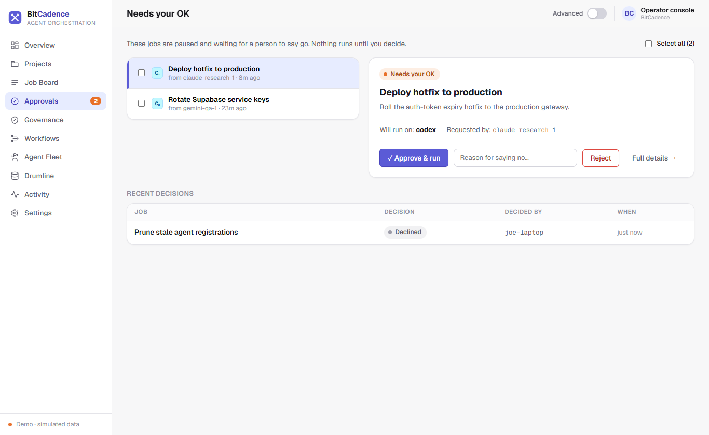
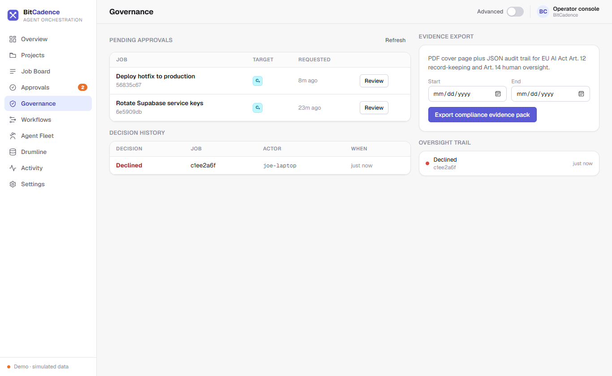

# Approvals & Governance

## Goal
Implement human-in-the-loop oversight, authorize or reject high-risk agent operations at safety gates, trigger the emergency kill switch, and export tamper-evident audit evidence packs.

---

## Step-by-Step Instructions

### 1. Navigate to the Approval Queue
Click **Approval Queue** (or *"Needs your OK"*) in the left navigation sidebar. 
The badge next to the menu item shows the count of jobs currently halted at an approval gate.



### 2. Reviewing a Gated Job
Each card in the approval queue presents:
- **Job Title & ID:** What the agent intends to do.
- **Requesting Agent:** Who created or forwarded the request.
- **Target Worker:** The agent that will execute the operation if approved.
- **Instructions / Payload:** The exact parameters, scripts, or targets.

### 3. Making an Approval Decision
- **To Authorize:** Click the green **Approve** button.
  - The job transitions from `needs_approval` to `pending`.
  - Eligible workers can now atomically lease and run the task.
  - The audit log permanently records your identity in `approved_by`.
- **To Decline:** Click the red **Reject** button.
  - A prompt asks for a rejection reason (e.g., *"Unauthorized environment"* or *"Too risky"*).
  - The job transitions to the terminal status `rejected`. Workers will never touch it.

### 4. Emergency Kill Switch
When an unexpected agent loop or fleet emergency occurs:
1. In the navigation sidebar, click **Governance**.



2. Under **Panic button / Kill Switch**, toggle **Kill Switch** to `ON`.
   - All worker leasing immediately stops.
   - No new jobs can be claimed or started across the entire fleet.
   - In-flight work finishes gracefully; operators can still audit, inspect, and approve/reject.
3. Once the situation is resolved, toggle the switch back to `OFF` to resume normal leasing.

### 5. Exporting Audit Evidence Packs
Under **Tamper-Evident Audit Trail**:
1. Click **Export Audit Pack**.
2. A cryptographically verifiable JSON package containing the complete history of events, actors, timestamps, and hashes is generated and downloaded to your computer.

---

## The CLI Equivalent

```powershell
# Approve a job at the human gate
mco approve <job-id>

# Reject a job with recorded rationale
mco reject <job-id> --reason "Production deployment window closed"

# View tamper-evident event history
mco audit <job-id>

# Export a signed cryptographic audit checkpoint
mco audit-checkpoint

# Enable emergency kill switch from terminal
mco settings set MCO_KILL_SWITCH true
mco restart
```

---

## What You'll See

- **Immutable History:** In the database (`agent_job_events`), every approval decision is written to an append-only table. Any database `UPDATE` or `DELETE` query on this table is rejected at the storage engine level.
- **Audit Receipt:** In the Job Detail Drawer, the audit history explicitly stamps:
  ```text
  approved · actor: local-operator (role: admin) · 2026-10-03 12:25:00 UTC
  ```

---

## If It Goes Wrong

### 1. "403 Forbidden: Approver role required"
- **Cause:** The bearer token used to approve the job belongs to an agent role that is not listed in `MCO_APPROVER_ROLES`.
- **Fix:** By default, approver roles are `human,admin,operator`. Re-authenticate with an admin or human token, or configure:
  ```powershell
  mco settings set MCO_APPROVER_ROLES "human,admin,operator,reviewer"
  ```

### 2. "Kill switch active: Cannot lease task"
- **Cause:** The kill switch was left enabled (`MCO_KILL_SWITCH=true`).
- **Fix:** In the Governance screen, switch the panic toggle to OFF, or run:
  ```powershell
  mco settings set MCO_KILL_SWITCH false
  ```
