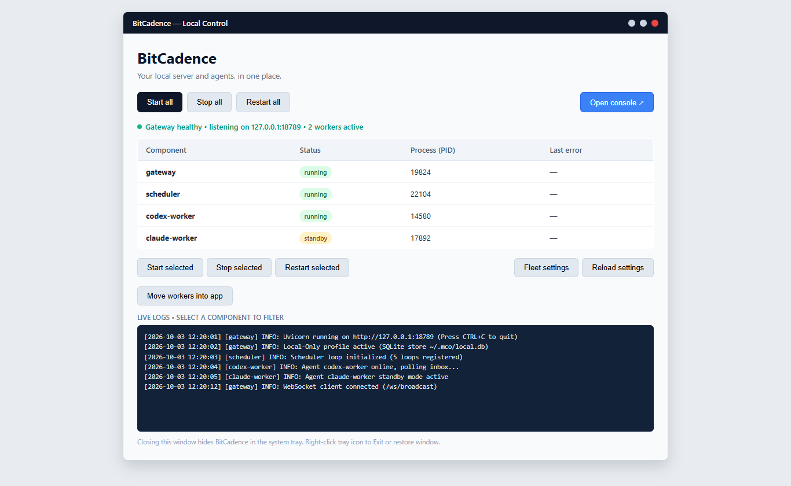

# Desktop Manager, Installer & System Tray

## Goal
Install, launch, operate, update, and troubleshoot the native BitCadence Windows Desktop Manager (`scripts/desktop.pyw`), system tray icon, one-click installer, and background process supervisor without keeping raw terminal windows open.

---

## Architecture Overview

BitCadence provides a window-free, supervisor-managed desktop experience on Windows. It bridges command-line daemons and the browser Control Panel into a single executable workflow:

```
                               +-------------------------------------+
                               |           Desktop Shortcut          |
                               |          ("BitCadence.lnk")         |
                               +-------------------------------------+
                                                  |
                                                  v
                               +-------------------------------------+
                               |            pythonw.exe              |
                               |      (Subsystem: Windows GUI)       |
                               |    No black CMD console window!     |
                               +-------------------------------------+
                                                  |
                                                  v
                               +-------------------------------------+
                               |        scripts/desktop.pyw          |
                               |    --start-all    --minimized       |
                               +-------------------------------------+
                                                  |
                         +------------------------+------------------------+
                         |                                                 |
                         v                                                 v
           +---------------------------+                     +---------------------------+
           |     Tkinter Control UI    |                     |     Pystray Notification  |
           |     ("Local Control")     |                     |     System Tray Icon      |
           +---------------------------+                     +---------------------------+
                         |                                                 |
                         +------------------------+------------------------+
                                                  |
                                                  v
                               +-------------------------------------+
                               |      StackSupervisor Controller     |
                               |    Windows Job Object Isolation     |
                               +-------------------------------------+
                                     |            |            |
                    +----------------+            |            +----------------+
                    |                             |                             |
                    v                             v                             v
           +------------------+          +------------------+          +------------------+
           |  Gateway Server  |          | Scheduler Daemon |          |  Worker Wakers   |
           |    mco serve     |          | mco schedule run |          |  (fleet.toml)    |
           +------------------+          +------------------+          +------------------+
```

---

## Step-by-Step Instructions

### 1. Installation: One-Click Installer & Desktop Shortcut

BitCadence offers two installation methods on Windows:

#### Method A: The One-Click Installer (`install.bat` / `scripts/install.ps1`)
For new users and end-user workstations:
1. Double-click **`install.bat`** in the repository root (or run `powershell -ExecutionPolicy Bypass -File scripts\install.ps1`).
2. The installer automatically:
   - Locates or downloads Python 3.9+.
   - Creates a private virtual environment (`.venv`).
   - Generates a local access token (`mco_tok_...`) and configuration (`~/.mco/.env`).
   - Adds `mco` to your User `PATH` (`%LOCALAPPDATA%\BitCadence\bin`).
   - Creates a **BitCadence** shortcut on your Desktop pointing to the launcher.

#### Method B: Desktop Component Setup (`scripts/install_desktop.ps1`)
For existing source checkouts or developers:
```powershell
powershell -ExecutionPolicy Bypass -File scripts\install_desktop.ps1 -Python .\.venv\Scripts\python.exe
```
This script:
1. Installs desktop UI dependencies (`pystray`, `Pillow`) into `.codex/desktopdeps`.
2. Generates the official multi-resolution icon (`.codex/bitcadence.ico`).
3. Verifies that `pythonw.exe` exists in your Python directory.
4. Generates standard Windows shortcuts (`BitCadence.lnk`) in both your **Desktop** and **Start Menu Programs** folders pointing to:
   ```
   Target: <path-to>\pythonw.exe "<repo-root>\scripts\desktop.pyw"
   Start In: <repo-root>
   ```

---

### 2. First Launch & Guided Startup

Double-click the **BitCadence** icon on your Desktop or Start menu.



#### What Happens on First Launch:
1. **Window-Free Launch:** Launched via `pythonw.exe`, so no black command prompt window flashes or remains on your screen.
2. **Single-Instance Guard:** If BitCadence is already running, launching the shortcut again does not start a duplicate server. Instead, it signals the existing instance via `~/.mco/desktop/show-window` and brings the existing window to the front.
3. **Automatic Component Discovery:** The app inspects your system to identify running gateways, schedulers, and workers.
4. **Clicking "Start All":**
   - Starts the Gateway API server (`http://127.0.0.1:18789`).
   - Waits for the `/readyz` health probe to pass (up to 30 seconds).
   - Starts the background Scheduler daemon.
   - Starts all configured workers in `~/.mco/fleet.toml` whose mode is set to `waker` or `poll`.

---

### 3. What Starts Automatically

When you click **Start all** (or launch with `--start-all`), the supervisor starts the complete local stack in strict topological order:

| Component | Command Invoked | Purpose |
|---|---|---|
| **Gateway Server** | `python.exe -m mco.cli serve --host 127.0.0.1 --port 18789` | Local API server, SQLite database interface, SSE event bus, and Web Console backend. |
| **Scheduler** | `python.exe -m mco.cli schedule run` | Evaluates cron loops and interval automation declared in `~/.mco/schedules.yaml`. |
| **Fleet Workers** | Commands configured in `~/.mco/fleet.toml` | Starts event wakers or polling processes for each active agent (e.g., `codex-beast`, `claude-cio`). |

> **Process Guard (Windows Job Object):** All child processes spawned by the supervisor are attached to a Windows Job Object configured with `JOB_OBJECT_LIMIT_KILL_ON_JOB_CLOSE`. If the desktop supervisor terminates unexpectedly or crashes, the Windows kernel automatically terminates all child worker processes, preventing orphaned background zombies.

---

### 4. System Tray & Minimized Behavior

The Desktop Manager integrates with the Windows Notification Area (System Tray):

- **Minimizing to Tray on Close (X):** Clicking the **X** button in the window title bar does **not** terminate BitCadence. It withdraws the window into the notification tray, keeping all background agents and the gateway running uninterrupted.
- **Starting Minimized at Boot:** Running with the `--minimized` flag starts the application directly in the notification tray without ever flashing a GUI window:
  ```powershell
  pythonw.exe scripts\desktop.pyw --start-all --minimized
  ```
- **System Tray Context Menu:** Right-clicking the BitCadence tray icon provides:
  - **Open BitCadence:** Restores the main Control window.
  - **Start all:** Starts all configured stack components.
  - **Stop all:** Gracefully stops workers, scheduler, and gateway.
  - **Open console:** Launches your default web browser directly to `http://127.0.0.1:18789/console`.
  - **Exit:** Gracefully terminates all supervisor-owned child processes and exits the application completely.

---

### 5. Configuring Autostart on Sign-in

To have BitCadence automatically start in the tray whenever you log in to Windows:

```powershell
powershell -ExecutionPolicy Bypass -File scripts\desktop_autostart.ps1 -Pythonw "C:\path\to\.venv\Scripts\pythonw.exe"
```

This places a shortcut in `%APPDATA%\Microsoft\Windows\Start Menu\Programs\Startup` configured with `--start-all --minimized`.

To remove autostart:
```powershell
powershell -ExecutionPolicy Bypass -File scripts\desktop_autostart.ps1 -Remove
```

---

### 6. Where the Logs Live

BitCadence organizes logs cleanly on disk:

| Log File | Path | What It Contains |
|---|---|---|
| **Desktop Supervisor** | `~/.mco/desktop/logs/desktop.log` | Supervisor lifecycle events, start/stop requests, and process health checks. |
| **Component Logs** | `~/.mco/desktop/logs/<component>.log` | Combined stdout/stderr for each individual managed component (`gateway.log`, `scheduler.log`, `<instance>.log`). |
| **Standalone Gateway** | `~/.mco/logs/gateway.log` | Gateway server logs when run outside the desktop supervisor. |
| **Individual Agent Logs** | `~/.mco/logs/<instance>.log` | Output generated by worker CLI executors. |

#### Filtering Logs in the GUI:
In the Desktop Control window:
1. Click any row in the **Component table** (e.g., `gateway` or `claude-cio`).
2. The bottom log viewer instantly filters to show the last 100 lines of output for that selected component.
3. Deselecting rows returns to the unified log stream.

---

### 7. Updating BitCadence

#### Updating Source Installations:
The setup script includes automated upstream update checks:
1. Open PowerShell in the BitCadence directory:
   ```powershell
   git pull --ff-only origin main
   ```
2. In the Desktop Control window, click **Reload settings** to pick up configuration changes, or click **Restart all** to restart services with updated code.

#### Updating Package Installations:
If installed via pip:
```powershell
pip install --upgrade "bitcadence[desktop]"
```

---

### 8. Uninstalling

To cleanly remove BitCadence from your computer:
1. **Exit the Desktop Manager:** Right-click the system tray icon and select **Exit** (or run `python -m mco.desktop.app --quit`).
2. **Remove Autostart:**
   ```powershell
   powershell -ExecutionPolicy Bypass -File scripts\desktop_autostart.ps1 -Remove
   ```
3. **Remove Shortcuts:** Delete `BitCadence.lnk` from your Desktop and Start Menu Programs folders.
4. **Clean up Configuration & Logs:** Delete the `~/.mco` directory (`Remove-Item -Recurse ~/.mco`).
5. **Delete Repository / Environment:** Delete the BitCadence installation folder.

---

## Operating System Compatibility: Linux & macOS Status

| Platform | Desktop Manager GUI (`desktop.pyw`) | Background Service Deployment | Browser Web Console |
|---|:---:|:---:|:---:|
| **Windows 10/11** | **Full Support** (Native Tkinter + Pystray + Job Objects) | Task Scheduler (`schtasks`) | Supported |
| **Linux (Ubuntu/Debian/RHEL)** | *Not Supported* (CLI returns error) | Native `systemd` user units | Supported |
| **macOS (Apple Silicon & Intel)** | *Not Supported* (CLI returns error) | Native `launchd` user plists | Supported |

### Linux Alternative:
On Linux, the Desktop GUI is deliberately disabled (`if os.name != "nt": raise SystemExit("The desktop manager currently supports Windows.")`). Instead, Linux operators use native `systemd` user units:
```bash
mco service install
systemctl --user enable --now bitcadence-gateway
systemctl --user enable --now bitcadence-scheduler
```
Access the UI via browser at `http://127.0.0.1:18789/console`.

### macOS Alternative:
On macOS, background persistence is managed via native `launchd`:
```bash
mco service install
launchctl load ~/Library/LaunchAgents/com.bitcadence.gateway.plist
```
Access the UI via browser at `http://127.0.0.1:18789/console`.

---

## If It Goes Wrong

### 1. "SupervisorAlreadyRunning" Error on Startup
- **Cause:** Another instance of `desktop.pyw` is already running or held open in the system tray.
- **Fix:** Check your system tray (notification area overflow arrow). If present, right-click and choose **Open BitCadence**. If stuck, terminate lingering Python processes:
  ```powershell
  python -m mco.desktop.app --quit
  ```

### 2. "Pillow or pystray not found"
- **Cause:** Python environment was installed without desktop dependencies.
- **Fix:** Run the dependency installer:
  ```powershell
  powershell -ExecutionPolicy Bypass -File scripts\install_desktop.ps1
  ```

### 3. "Gateway failed readiness probe"
- **Cause:** Port 18789 is occupied by an orphaned process or external server.
- **Fix:** Check what process is listening on port 18789:
  ```powershell
  Get-NetTCPConnection -LocalPort 18789 -ErrorAction SilentlyContinue | Select-Object OwningProcess
  ```
  Terminate the lingering process or change the port in Desktop settings.
