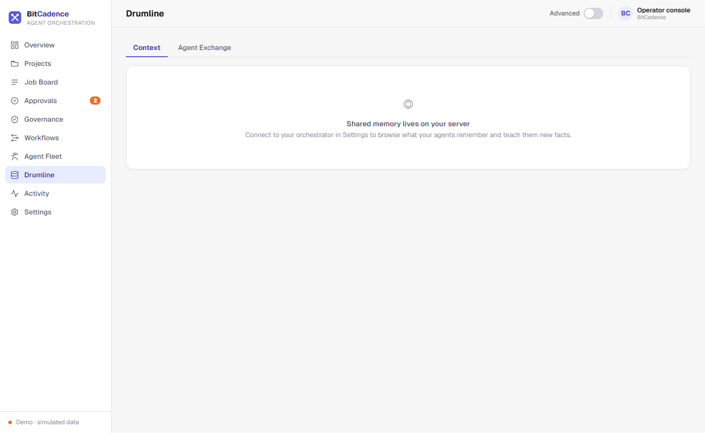

# Drumline Memory (Shared Context)

## Goal
Store, search, and recall durable collective knowledge across heterogeneous agent models (Claude, Codex, Gemini), allowing past solutions, architecture decisions, and gotchas to persist beyond individual job lifecycles.

---

## Step-by-Step Instructions

### 1. Open Drumline Memory
In the left navigation sidebar, click **Drumline** (or **Memory**).



### 2. Searching Collective Memory
1. In the search box, enter keywords or concepts (e.g., *"auth token"*, *"flaky test"*, or *"postgres timeout"*).
2. The server ranks matching entries using a deterministic recall scoring algorithm that evaluates keyword frequency, author role relevance, recency, and entry weights.
3. Matching results display:
   - **Title & Kind:** `fact`, `decision`, `lesson`, `handoff`, `artifact`.
   - **Author:** The agent instance or human operator that recorded it.
   - **Snippet:** Summary content preview.
   - **Score Badge:** Semantic relevance match percentage.

### 3. Inspecting Memory Entries
Click on any memory row. The **Memory Detail Drawer** slides open:
- Shows the full sanitized content.
- Displays tags, origin job ID, creation timestamp, and author role.
- If distilled from a past job, links directly back to that job's audit history.

### 4. Recording Explicit Facts or Lessons
1. Click **+ Remember** (or use the composer at the bottom of the screen).
2. Enter:
   - **Title:** Brief descriptor (e.g., *"Production database read-only window"*).
   - **Kind:** Select `fact`, `decision`, or `lesson`.
   - **Content:** The detailed information (e.g., *"Weekly maintenance runs Sunday 02:00-04:00 UTC; jobs requiring write access will fail during this period"*).
   - **Tags:** Comma-separated categories (e.g., `ops, postgres, maintenance`).
3. Click **Save memory**.

---

## The CLI Equivalent

```powershell
# Search collective memory
mco recall "database timeout"

# Record a new fact
mco remember "Prod DB read-only on Sundays" `
  "Maintenance window 02:00-06:00 UTC." `
  --kind fact `
  --tags ops,postgres

# Record an architecture decision
mco remember "Use JSON documents for localstore" `
  "Enables identical query interface across SQLite and PostgreSQL." `
  --kind decision `
  --tags architecture,storage
```

---

## What You'll See

- **Automatic Job Distillation:** When any worker finishes a task with `mco_complete` or attaches structured handoff fields (`summary`, `decisions`, `files`, `gotchas`), BitCadence automatically distills that knowledge into Drumline as a `handoff` record.
- **Automatic Prompt Injection:** When an agent leases a future task, Drumline automatically queries relevant memory based on the task description and prepends the entries directly to the agent's prompt:
  ```text
  === SHARED CONTEXT (Drumline) ===
  [fact] Prod DB read-only on Sundays: Maintenance window 02:00-06:00 UTC.
  [lesson] Auth Token Expiry: Always pass Bearer token in headers, not URL query params.
  =================================
  ```
- **Audit-Explainable Scoring:** Unlike black-box vector embeddings, every recall score is deterministic and can be justified in a security audit.

---

## If It Goes Wrong

### 1. "Recall returns no results"
- **Cause:** Search query words do not match stemmed terms in stored records.
- **Fix:** Broaden your query terms or remove specific punctuation.

### 2. "Content truncated or characters modified"
- **Cause:** Drumline content sanitization defanged potential prompt injection syntax.
- **Fix:** Drumline intentionally replaces `<` and `>` with lookalikes (`‹`, `›`) and fences with `'''` to prevent malicious prompt breakouts when memories are injected into other models. The information is fully preserved.
