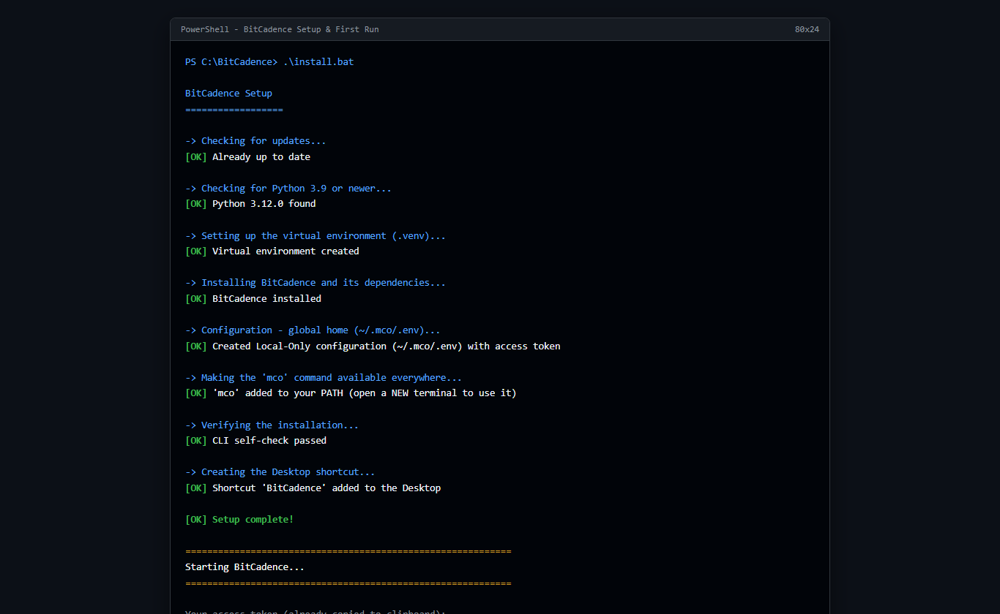

# Install & First Run

## Goal
Install BitCadence on your machine with zero configuration, create an isolated local Python environment, initialize a secure operator access token, and start the system for the first time.

---

## Step-by-Step Instructions (Windows One-Click)

### 1. Download and Extract BitCadence
Download the BitCadence repository archive or clone it into a local folder on your computer (for example, `C:\BitCadence` or `C:\AI\baton\Batoncadence`).

### 2. Run the Installer
Double-click **`install.bat`** located in the root folder of the BitCadence project.
Alternatively, launch PowerShell in that folder and run:
```powershell
powershell -ExecutionPolicy Bypass -File scripts\install.ps1
```

The script automatically executes six distinct setup stages:
1. **Python Check:** Locates an existing Python 3.9+ installation, or automatically prompts to install it via Windows Package Manager (`winget`).
2. **Virtual Environment:** Generates an isolated `.venv` directory to keep all project dependencies self-contained.
3. **Editable Installation:** Installs BitCadence (`mco`) and required libraries in development/editable mode.
4. **Configuration Generation:** Creates a global configuration at `~/.mco/.env` with the `Local-Only` profile and mints a high-entropy bearer token (`mco_tok_...`).
5. **Path Integration:** Adds `mco` to your user `PATH` (under `%LOCALAPPDATA%\BitCadence\bin`).
6. **Desktop Shortcut:** Creates a desktop shortcut named **BitCadence** that points to `Start BitCadence.bat`.



### 3. Launching BitCadence
When the installer asks:
```text
Would you like to start BitCadence now? [Y/n]
```
Press **Enter**. 

The server window appears, displays your generated access token, copies it automatically to your Windows clipboard, and opens your default web browser to `http://127.0.0.1:18789/console`.

---

## The CLI Equivalent

For power users or headless environments, you can perform the entire installation manually:

```powershell
# 1. Create virtual environment
python -m venv .venv
.\.venv\Scripts\Activate.ps1

# 2. Install BitCadence dependencies
pip install -e .

# 3. Create global configuration home
mkdir -p "$HOME\.mco"

# 4. Generate token and environment file
$TOKEN = "mco_tok_" + [System.Guid]::NewGuid().ToString("N")
@"
MCO_PROFILE=Local-Only
OPERATOR_NAME=$env:USERNAME
MCO_LOCAL_TOKEN=$TOKEN
"@ | Out-File -Encoding ascii "$HOME\.mco\.env"

# 5. Start the gateway server
mco serve
```

---

## What You'll See

- A black command window titled **BitCadence Server** displaying:
  ```text
  ============================================================
    Starting BitCadence...
  ============================================================

    Your access token (already copied to clipboard):

      mco_tok_a1b2c3d4e5f6...

    In 5 seconds your browser will open the console.
    Paste the token into the "Agent token" box and click Connect.

    Keep this window open while BitCadence is running.
    Close it to stop BitCadence.
  ============================================================
  ```
- Your web browser will open to the BitCadence Web Console at `http://127.0.0.1:18789/console`.
- In the background, SQLite databases and keys are stored locally in your user profile:
  - Configuration: `~/.mco/.env`
  - Embedded Document Store: `~/.mco/local.db`
  - Secrets Vault: `~/.mco/secrets.enc`

---

## Linux & macOS State

BitCadence is engineered with platform neutrality in its Python core:
- **macOS / Linux Installer:** Run `curl -sSf https://bitcadence.ai/install.sh | bash` or execute `bash scripts/install.sh` from the repository root.
- **Service Deployment:** On Linux, `mco service install` provisions standard `systemd` unit files under `~/.config/systemd/user/bitcadence.service`.
- **Desktop Manager Constraint:** The native desktop GUI supervisor (`src/mco/desktop/app.py` and `mco tray`) uses Windows Tkinter and Windows Job Objects. On Linux and macOS, users interact with BitCadence through the `mco` CLI and the browser-based web console (`http://localhost:18789/console`).
- **Keychain / Secret Store:** On Windows, the secret store automatically leverages Windows Credential Manager. On Linux/macOS, auto-unlock uses the `MCO_VAULT_MASTER_KEY` environment variable.

---

## If It Goes Wrong

### 1. "Python was not found" or setup window closes immediately
- **Cause:** Execution policy restrictions or missing Python on your system PATH.
- **Fix:** Open PowerShell as Administrator and run:
  ```powershell
  winget install --id Python.Python.3.12 -e
  ```
  Then restart your terminal and re-run `install.bat`.

### 2. "Port 18789 is already in use"
- **Cause:** Another instance of BitCadence or another local development server is bound to port 18789.
- **Fix:** Specify an alternate port when running `mco serve`:
  ```powershell
  mco serve --port 18790
  ```
  Then navigate in your browser to `http://127.0.0.1:18790/console`.

### 3. "Cannot connect to server in browser"
- **Cause:** The server process was closed, or Windows Defender Firewall blocked loopback traffic.
- **Fix:** Keep the command window open while working. Test loopback health directly in terminal:
  ```powershell
  curl http://127.0.0.1:18789/healthz
  ```
  If it returns `{"status":"ok"}`, the server is running normally.
