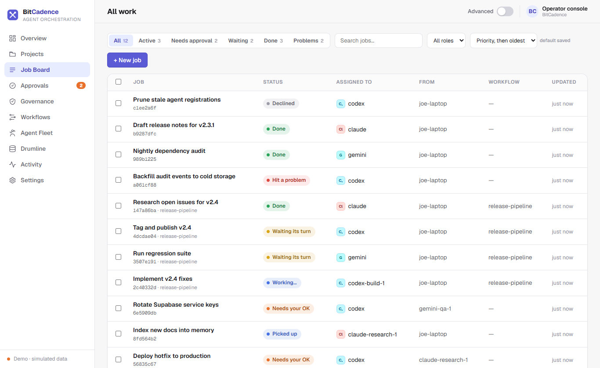
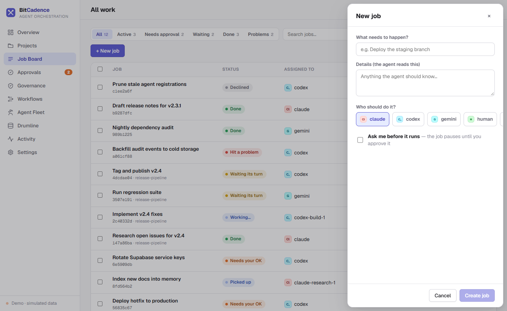
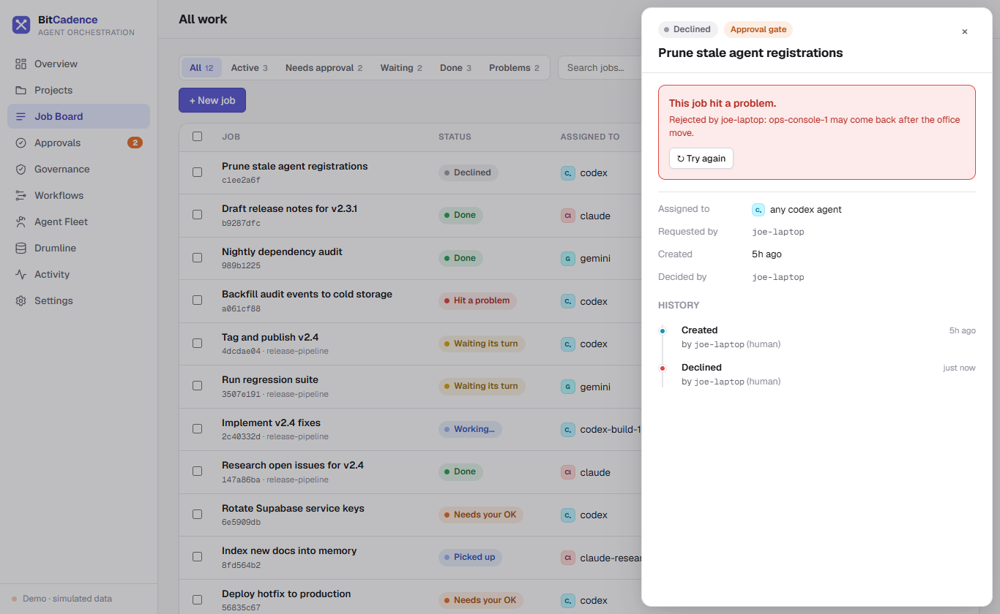

# Job Board & Managing Tasks

## Goal
Submit new tasks to agent dropboxes, inspect real-time queue states, examine tamper-evident execution drawers, and manage task lifecycles (retries, cancellations, reassignments, and archiving).

---

## Step-by-Step Instructions

### 1. Open the Job Board
In the left navigation bar, click **Job Board** (or *"All work"* in Plain English mode).



### 2. Filter and Search Tasks
1. Use the status filter pills at the top to focus on specific states:
   - **Needs approval:** Paused at human gate.
   - **Pending:** Waiting in dropbox for worker pickup.
   - **Running:** Leased by an active agent.
   - **Completed:** Successfully finished.
   - **Failed / Rejected:** Halted with error or rejected by human.
2. Type in the search box to filter by title, description, or job ID.

### 3. Creating a New Job
1. Click the **+ New job** button in the upper right.
2. Fill out the composer modal:
   - **Title:** Plain-English summary of what the agent should do (e.g., *"Summarize repository changes"*).
   - **Target Role:** The agent specialization required (`codex`, `claude`, `gemini`, `reviewer`, etc.).
   - **Instructions:** Full prompt, parameters, or specifications for the agent.
   - **Requires approval:** Check this box if the task must pause for human review before execution.
   - **Max retries:** Number of automatic retry attempts if the worker fails.



3. Click **Submit job**. The task appears instantly on the Job Board.

### 4. Inspecting Job Details & Audit Trail
Click any job row in the table. The **Job Detail Drawer** slides open from the right:
- **Header:** Displays job ID, status badge, created timestamp, and duration.
- **Assignment:** Shows source agent, target role, and the specific agent instance that leased it.
- **Instructions:** Full prompt text given to the agent.
- **Output / Result:** When completed, displays the agent's verbatim response and structured handoff.
- **Audit Trail:** Append-only timeline showing exact timestamps for `created`, `leased`, `status:completed`, and `context_distilled`.



### 5. Managing Job Actions
From the bottom of the Job Detail Drawer (or row menu):
- **Approve / Reject:** Available when job status is `needs_approval`.
- **Retry:** Re-queues a failed or rejected job back to `pending`.
- **Cancel:** Aborts an in-flight or waiting job.
- **Reassign:** Clones a failed job onto a different target agent role and archives the original.
- **Archive / Unarchive:** Moves completed or cancelled jobs to cold view without deleting audit history.
- **Check Duplicates:** Checks whether identical work has already been performed or queued elsewhere.

---

## The CLI Equivalent

Every Job Board action maps directly to the `mco` command-line tool:

```powershell
# Drop a new job into an agent's inbox
mco send "Summarize the repository" `
  --role codex `
  --instructions "Review recent commits on main and summarize changes." `
  --approval

# Inspect tamper-evident audit history
mco audit <job-id>

# Check for duplicate tasks
mco duplicates <job-id>

# Retry a failed job
mco retry <job-id>

# Cancel a job
mco cancel <job-id>

# Reassign a job to a different role
mco reassign <job-id> --to-role claude

# Archive a completed job
mco archive <job-id>
```

---

## What You'll See

- **Atomic Leases:** When a worker picks up a job, the status changes from `pending` to `leased` / `in_progress`. The table stamps `leased_by_instance_id` with the worker's unique ID.
- **Tamper-Evident History:** The audit trail shows every transition with the exact actor ID and UTC timestamp. The database prohibits updating or deleting historical event rows.

---

## If It Goes Wrong

### 1. "Job stuck in 'waiting' status"
- **Cause:** The job has dependencies (`depends_on`) that have not yet reached `completed`.
- **Fix:** Open the Job Detail Drawer, check the **Depends on** field, and ensure the parent job finishes successfully.

### 2. "Job stuck in 'needs_approval' status"
- **Cause:** The job was created with governance enabled and is paused at a human gate.
- **Fix:** Go to the **Approval Queue**, review the instructions, and click **Approve**.

### 3. "Job immediately fails with 'S3 / Network / Tool error'"
- **Cause:** The agent crashed or encountered an unhandled exception during execution.
- **Fix:** Inspect the error message in the drawer. If transient, click **Retry**. If the assigned agent role cannot handle the task, click **Reassign** to route to another role.
