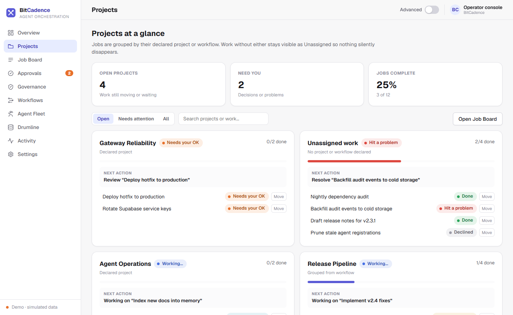

# Projects Dashboard

## Goal
Group disparate agent tasks into cohesive business projects and initiatives, observe project-level health and completion velocity, and detect blocked or stalled initiatives.

---

## Step-by-Step Instructions

### 1. Navigate to Projects
In the left-hand navigation sidebar, click **Projects**.



### 2. Inspect Project Groups
The dashboard automatically groups jobs based on their `input_payload.project` attribute (e.g., `gateway-reliability`, `agent-operations`, `release-2.4`):
- Each project card displays:
  - **Project Name & Slug**
  - **Health Indicator:** 
    - 🟢 **Healthy:** Active jobs completing without errors.
    - 🟡 **Warning:** Jobs paused at approval gates or waiting on retries.
    - 🔴 **Blocked:** One or more jobs permanently failed, rejected, or stalled.
  - **Progress Bar:** Ratio of completed tasks to total assigned tasks.
  - **Active Work:** Tasks currently being worked on by specific agents.

### 3. Filter Jobs by Project
Click on any project card (or the **Show jobs** button):
- The view automatically transitions to the **Job Board** pre-filtered to show only tasks belonging to that specific project stream.

### 4. Assigning a Job to a Project
When creating a job (via UI or CLI), attach project context inside the job metadata:
- In the New Job form, specify:
  ```json
  {
    "project": {
      "id": "gateway-reliability",
      "name": "Gateway Reliability"
    }
  }
  ```

---

## The CLI Equivalent

You can inspect and assign projects from the command line:

```powershell
# Assign an existing job to a project
curl -X POST http://127.0.0.1:18789/api/jobs/<job-id>/project `
  -H "Authorization: Bearer $env:MCO_AGENT_TOKEN" `
  -H "Content-Type: application/json" `
  -d '{"project": "gateway-reliability"}'

# Fetch project-level aggregate view
curl http://127.0.0.1:18789/api/project-view `
  -H "Authorization: Bearer $env:MCO_AGENT_TOKEN"
```

---

## What You'll See

- **High-Level Rollup:** Instead of scrolling through hundreds of granular agent tasks, you see 3–5 top-level project initiatives.
- **Coverage Summary:** The top header displays total managed project tasks, active count, and whether coverage is truncated (up to 5,000 tasks evaluated server-side).

---

## If It Goes Wrong

### 1. "Jobs appear in 'Uncategorized' project"
- **Cause:** Jobs were created without a `project` key in their `input_payload`.
- **Fix:** Add `"project": "my-project-name"` to the job creation payload or workflow YAML definition.

### 2. "Project marked as Blocked"
- **Cause:** A prerequisite job in a workflow failed or was rejected, stopping downstream dependent tasks.
- **Fix:** Click the project card to view the jobs, open the failed job, and either click **Retry** or **Reassign** to clear the block.
