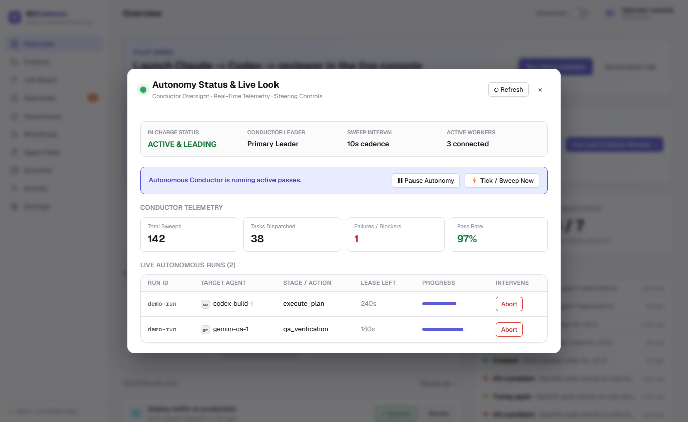

# Autonomous Scores & Conductor

## Goal
Author, validate, and monitor **Scores** — versioned, deterministic JSON contracts that coordinate long-running autonomous development and operations runs with cryptographic evidence, resource locks, and policy gates.

---

## Step-by-Step Instructions

### 1. What is a Score?
Unlike simple jobs or legacy workflows, a **Score** is an immutable, digest-bound contract that defines:
- The complete goal hierarchy and dependency graph.
- Required worker capabilities and role boundaries (independent authors and reviewers).
- Resource locks (such as isolated repository worktrees or deployment lanes).
- Mandatory test evidence and verification receipts.
- Explicit human checkpoints and integer-cent budget limits.

### 2. Inspecting Score Runs in the Console
1. On the **Overview** screen, locate the **Autonomous Score Conductor** card.
2. Click **Live look**.



3. The modal displays:
   - **Active Runs:** Currently executing score runs (e.g., `via-cloud-run-001`).
   - **Current Stage:** Execution phase (`execute_plan`, `qa_verification`, `evidence_review`).
   - **Target Agent:** Active worker instance assigned by the Conductor.
   - **Score Progress Bar:** Calculated percent completion of goal dependencies.
   - **Conductor Status:** Sweep state, lease expiration timers, and next dispatch tick.

### 3. Validating and Compiling Scores Offline
Before submitting any score, validate and compile it locally using the offline kernel:

```powershell
# 1. Validate score structure against JSON Schema
python -m mco.orchestrator.scores validate examples\scores\via-cloud.score.json

# 2. Compile score into deterministic, digest-bound work packets
python -m mco.orchestrator.scores compile examples\scores\via-cloud.score.json

# 3. Preview planned tasks, dependencies, and capability requirements
python -m mco.orchestrator.scores preview examples\scores\via-cloud.score.json
```

---

## The CLI Equivalent

Manage and advance Score Conductor runs from PowerShell:

```powershell
# Check status of conductor and active score runs
mco score status

# List registered score documents and runs
mco score list

# Advance the conductor sweep engine
mco score tick

# Grant local development policy authority
mco score grant-local <run-id>
```

---

## What You'll See

- **Independent Review Enforced:** A worker cannot approve its own work. If `codex-build-1` authors a change, the Conductor requires an independent reviewer (`reviewer-beast` or `gemini-qa-1`) before the task is accepted.
- **Worker Completion ≠ Task Acceptance:** A worker returning `completed` does not advance the score. Only verified evidence artifacts and independent review receipts unlock downstream tasks.
- **Evidence Binding:** Every event is tied to the score document digest (SHA-256) and run ID, guaranteeing that changing a score contract invalidates previously issued approvals.

---

## If It Goes Wrong

### 1. "Score validation error: Cyclic dependency"
- **Cause:** One goal packet depends on another in a circular loop.
- **Fix:** Run `scores validate` to see the exact cycle path reported by the validator.

### 2. "Score run paused at human checkpoint"
- **Cause:** The score reached a stage with `checkpoint: true` requiring explicit owner authorization.
- **Fix:** Open the Governance or Approvals panel to sign off on the checkpoint decision.

### 3. "Budget reservation exceeded"
- **Cause:** Planned tasks request more compute or token expenditure than the authorized integer-cent limit (`authorized_budget_cents`).
- **Fix:** Issue an updated grant with higher budget limits using `mco score grant-local`.
