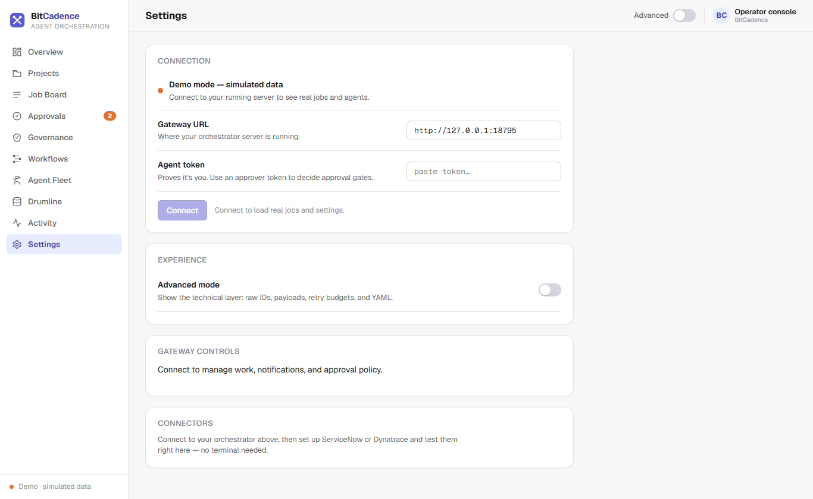

# Settings & Configuration

## Goal
Configure gateway operational parameters, customize user interface preferences, manage encrypted model API keys, inspect edition capabilities, and connect enterprise tools.

---

## Step-by-Step Instructions

### 1. Open Settings
Click **Settings** at the bottom of the left navigation sidebar.



### 2. Configure Interface Preferences
- **Tone:**
  - **Plain English:** Replaces technical jargon with accessible terms (*"All work"*, *"Needs your OK"*, *"Your agents"*).
  - **Expert Mode:** Displays raw IDs, UUIDs, retry budgets, PostgREST queries, and YAML DAGs.
- **Display Density:**
  - **Comfortable:** Generous padding and larger cards.
  - **Compact:** Higher information density for operations wallboards.
- **Accent Color:** Select from brand color presets.

### 3. Model Connections (LLM Provider Keys)
Under **Model Connections**:
1. Click **+ Add Connection**.
2. Select Provider: `Anthropic`, `OpenAI`, `Google Gemini`, or `Custom OpenAI-compatible`.
3. Enter API Key.
   - *Security Note:* API keys are write-only. They are encrypted immediately into `secrets.enc` using AES-256-GCM and never displayed back in plaintext.
4. Click **Test Connection** to verify key validity with the remote provider.

### 4. Edition & Feature Matrix
Review the **Edition Matrix** card:
- Displays current running edition: `community`, `team`, or `enterprise`.
- Shows available features:
  - Core: Job Board, Governance, Workflows, Drumline Memory, Console, MCP Server.
  - Team: Shared Gateway, Multi-tenant Orgs, RBAC Management.
  - Enterprise: Connectors (ServiceNow, Dynatrace), SSO, Audit Export.

---

## The CLI Equivalent

Manage configuration and secrets securely from your terminal:

```powershell
# Interactive setup walkthrough or menu
mco setup

# Inspect current settings
mco settings

# Update a setting safely
mco settings set MCO_DRUMLINE_DISTILL true

# Show active edition and feature availability
mco edition

# Run complete install diagnostics
mco doctor
```

---

## What You'll See

- **Automatic Secret Encryption:** Whenever you set a sensitive key (such as `ANTHROPIC_API_KEY` or `SERVICENOW_TOKEN`), BitCadence writes `encrypted_in_secret_store` to `.env` and encrypts the real secret inside `secrets.enc`.
- **Hot Reloading:** Configuration changes made via the settings API take effect immediately in the running gateway process.

---

## If It Goes Wrong

### 1. "Secret store locked: OS keychain unavailable"
- **Cause:** On Linux headless servers, Windows Credential Manager is not present.
- **Fix:** Set the master vault key in your environment:
  ```bash
  export MCO_VAULT_MASTER_KEY="your-32-byte-hex-key"
  ```

### 2. "Feature requires Team/Enterprise edition"
- **Cause:** Attempting to use a connector or multi-org tenancy while edition is set to `community`.
- **Fix:** Pin the edition in your `.env` or run:
  ```powershell
  mco settings set MCO_EDITION enterprise
  ```
