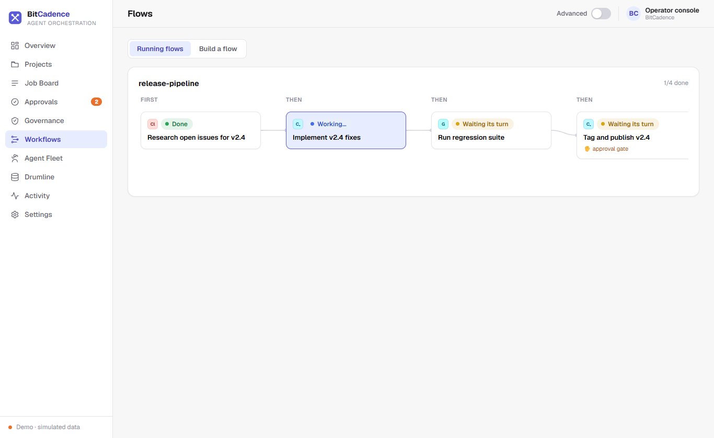
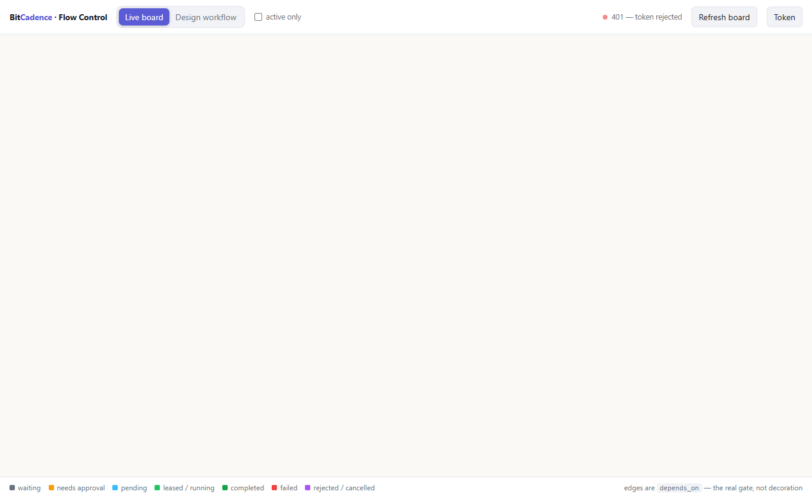
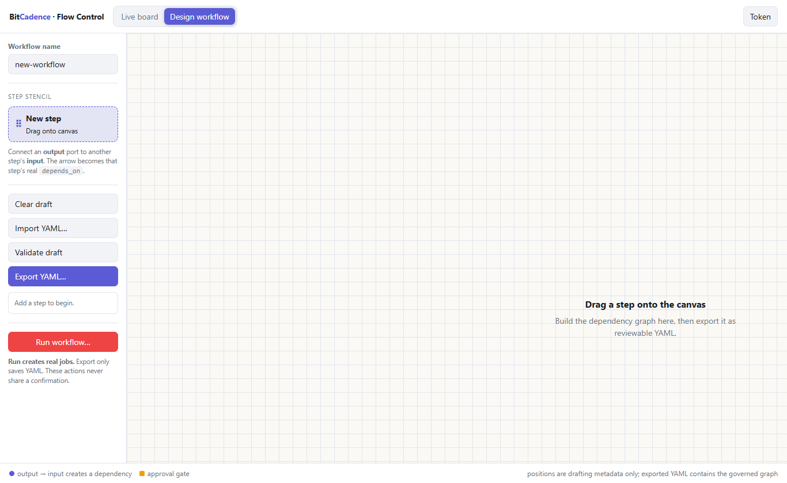

# Workflows & Flow Control

## Goal
Design multi-step agent pipelines (DAGs) visually, monitor real-time execution dependencies on the live animated Flow Control canvas (`/flow`), and run declarative YAML workflow files.

---

## Step-by-Step Instructions

### 1. Visual Workflow Builder in Console
1. In the left navigation sidebar, click **Workflows** (or *"Flows"*).



2. The canvas displays steps as connected cards:
   - **Step Card:** Contains Step ID, Assigned Role (`claude`, `codex`, `gemini`), Instructions, and Gate Checkbox.
   - **Dependencies:** Lines connect prerequisite steps to dependent steps.
3. Click **Add step** to append another stage to the pipeline.
4. Click **Export YAML** to view or download the declarative workflow configuration.
5. Click **Run workflow** to submit all steps as real, linked jobs on the Job Board.

### 2. Live Flow Control (`/flow`)
Open your browser to:
```text
http://127.0.0.1:18789/flow
```
or run:
```powershell
mco gui --flow
```



The Flow Control board renders your active job board as an interactive engineering mimic:
- **Real Edges:** Every arrow represents an enforced `depends_on` rule. A downstream job cannot start until upstream jobs complete.
- **Color Coded Status:**
  - ⚪ **Grey:** `waiting` (waiting for upstream completion)
  - 🟡 **Amber:** `needs_approval` (stopped at human gate)
  - 🔵 **Blue:** `pending` (ready for worker lease)
  - 🟢 **Green:** `leased` / `in_progress` (running)
  - 🌲 **Dark Green:** `completed` (finished)
  - 🔴 **Red:** `failed`
- **Animated Flowing Pulses:** Edges animate with moving dashes when active work is traversing from one completed step into the next stage.
- **Interactive Inspection:** Click any node to open the side panel, view instructions, examine audit trails, or click **Approve** directly from the canvas.

### 3. Flow Control Design Mode
In the top header of `/flow`, click **Design workflow**:



1. Drag **New step** from the drafting rail on the left onto the canvas grid.
2. Click a step card to edit its ID, role, title, and approval gate in the inspector.
3. Drag a connector from one step's **then** port to another step's **needs** port to establish a dependency.
4. Click **Validate** to verify that the graph is acyclic and all references are valid.
5. Click **Export YAML** or **Run workflow**.

---

## The CLI Equivalent

You can submit declarative YAML pipelines directly from your terminal:

```yaml
# pipeline.yaml
name: release-pipeline
steps:
  - id: research
    role: claude
    title: Research open bugs
    instructions: Identify critical bugs targeted for the v2.4 release.
  - id: fix
    role: codex
    title: Implement fixes
    instructions: Apply fixes identified in the research step.
    depends_on: [research]
  - id: ship
    role: codex
    title: Tag release
    instructions: Tag v2.4 release and publish artifacts.
    depends_on: [fix]
    requires_approval: true
```

Run the workflow:
```powershell
mco workflow pipeline.yaml
```

---

## What You'll See

- **Automatic Context Threading (Drumline):** When step 2 (`fix`) executes, BitCadence automatically prefixes its prompt with the **WORKFLOW THREAD** block containing the verbatim decisions and files from step 1 (`research`). No context is lost between different models.
- **Automatic Gating:** When step 3 (`ship`) is reached, it automatically stops at `needs_approval` and waits for human sign-off.

---

## If It Goes Wrong

### 1. "Cyclic dependency detected"
- **Cause:** Step A depends on Step B, and Step B depends on Step A.
- **Fix:** In the canvas or YAML file, remove the circular reference. Workflows must be strict Directed Acyclic Graphs (DAGs).

### 2. "Downstream steps fail after upstream failure"
- **Cause:** By default, dependent steps remain `waiting` if an upstream parent fails.
- **Fix:** Open the failed parent job, click **Retry**, or use `mco retry <parent-id>`. Once the parent succeeds, downstream steps unlock automatically.
